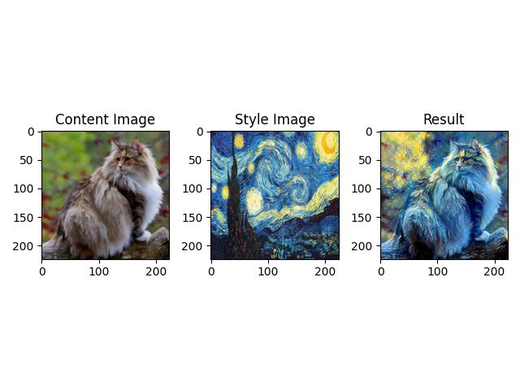

# Neural Style Transfer

## Introduction
This is an implementation of the paper "Image Style Transfer Using Convolutional Neural Networks"[1]. In this project, I use the VGG19[2] as the backbone for image feature extraction. The VGG19 extracts the content representation of the content image and the intermediate style representation of the style image. The final style representation is derived from the result of second order polynomial kernel of the intermediate style representation[3].

Note: During the feature extraction step, I use the output from the ReLU layer instead of convolutional layer, since original paper[1] stated that "So the responses in a layer $l$ can be stored in a matrix $F^l ∈ R^{N_{l}×M_{l}}$ where $F^{l}_{ij}$ is the **activation** of the $i$ th filter at position $j$ in layer $l$.". 

While generating the output image, the neural style transfer algorithm tries to minimize both the style loss and the content loss. However, the style loss and the content loss contradicts to each other in most cases(if the output image is "closer" to the content image, then it should be "farther" from the style image, and vice versa). Therefore, the final output image is at a balance point that possess both the content information from the content image and the texture from the style image.

## Results

### Content and Style Images

If without specifying, the default content and style image used are showed below.

  

Note that all the image sizes are resize to (224, 224). 

### $\alpha/\beta$ Ratios

The $\alpha$ and $\beta$ are the weights of content loss and style loss, respectively(refer to [1] for details).

  

The result shows the effect of the changing the ratio of $\alpha$ to $\beta$. When $\alpha / \beta$ is large, the output image tends to show more features from the content image(we can use the yellow lighting on the face of the cat as an indicator).

### Different Style Images

$\alpha/\beta=10^{-3}$ for all results below.

#### *De sterrennacht* by Vincent van Gogh

  

#### *Impression, soleil levant* by Claude Monet

  

#### *The Scream* by Edvard Munch

  

## References
[1] L. A. Gatys, A. S. Ecker and M. Bethge, Image Style Transfer Using Convolutional Neural Networks, 2016 IEEE Conference on Computer Vision and Pattern Recognition (CVPR), Las Vegas, NV, USA, 2016, pp. 2414-2423, doi: 10.1109/CVPR.2016.265.

[2] K. Simonyan and A. Zisserman, Very Deep Convolutional Networks for Large-Scale Image Recognition. arXiv, 2014. doi: 10.48550ARXIV.1409.1556.

[3] Y. Li, N. Wang, J. Liu, and X. Hou, Demystifying Neural Style Transfer. arXiv, 2017. doi: 10.48550/ARXIV.1701.01036.